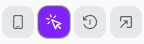
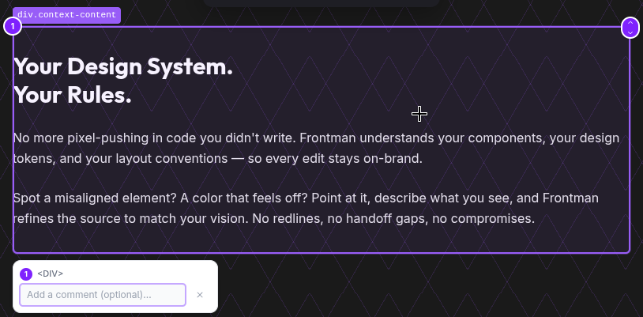
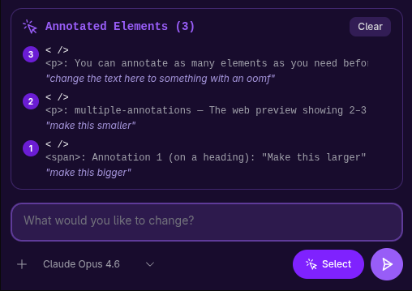
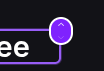
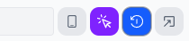

Annotations let you **point at elements** instead of describing them in text. Click an element in the [live preview](/docs/using/web-preview/), and Frontman captures its exact source file location, a screenshot, CSS selector, and surrounding context — then sends all of it to the agent alongside your prompt.

The result: the agent knows exactly which element you mean, which file to open, and what line to edit — no guessing, no searching.

## Enabling annotation mode

Click the **cursor icon** in the web preview toolbar to enter annotation mode. Your cursor changes to a crosshair, and elements highlight as you hover over them.



Click any element to annotate it. A numbered purple badge appears on the element, and a small popup opens below it where you can optionally type a comment.



To exit annotation mode, click the cursor icon again.

:::tip
You can annotate multiple elements before sending your prompt. Each gets its own numbered badge — the agent sees all of them in order.
:::

## What gets captured

When you click an element, Frontman immediately captures several layers of context:

| Data | Source | Purpose |
|------|--------|---------|
| **Source file & line** | Framework integration (Astro `data-astro-source-*` attributes, React fiber tree, or source maps) | Agent reads the exact file and line |
| **Screenshot** | Element-level capture via the preview iframe | Agent can see the visual state |
| **CSS selector** | Generated unique selector | Agent can locate the element in DOM tools |
| **Tag name** | DOM element tag (e.g., `<button>`, `<h2>`) | Provides structural context |
| **CSS classes** | Element's `class` attribute | Helps identify styling |
| **Component name** | Detected from framework metadata (e.g., `Hero`, `PricingCard`) | Agent understands the component hierarchy |
| **Component props** | Extracted from framework dev tooling (Astro integration) | Agent sees the data driving the component |
| **Nearby text** | `textContent` of the element (truncated to 200 chars) | Gives content context |
| **Bounding box** | `getBoundingClientRect()` coordinates | Positional context for layout changes |
| **Your comment** | What you type in the annotation popup | Tells the agent what you want changed |

This all happens asynchronously in the background. The badge pulses while data is loading and turns solid purple when enrichment is complete.

## Adding comments

When you annotate an element, a small popup appears below it with a text input. Comments are optional but powerful — they tell the agent **what** you want changed about **this specific element**.

```text
// Annotate a heading, then type:
"Make this 48px and semibold"

// Annotate a button, then type:
"Change the background to blue-600"
```

Press **Enter** or **Escape** to close the popup. The annotation stays regardless — comments just add extra instruction.

If you send a prompt without typing a comment, the agent still gets the full element context (file, screenshot, selector, etc.) and uses your chat message as the instruction.

## Working with multiple annotations

You can annotate as many elements as you need before sending a prompt. Each gets a numbered badge (1, 2, 3...) that the agent references as "Annotation 1", "Annotation 2", etc.



**Independent changes** — annotate each element with its own comment:
```text
Annotation 1 (on a heading): "Make this larger"
Annotation 2 (on a button): "Change the color to red"
Chat message: "Apply these changes"
```

**Related changes** — annotate the elements, then describe the change in the chat:
```text
Annotation 1 (on card 1)
Annotation 2 (on card 2)
Annotation 3 (on card 3)
Chat message: "Make all three cards the same height"
```

The agent automatically decides whether to process annotations as independent tasks (creating a todo list) or as a single coordinated change.

### Removing annotations

Click the **numbered badge** on any annotation to remove it. The remaining annotations renumber automatically.

### Navigating the DOM tree

Each annotation marker has small **↑ / ↓ chevrons** on its top-right corner:

- **↑** — replace this annotation with its parent element
- **↓** — replace this annotation with its first child element



This is useful when you click an element but realize you actually want its container (go up) or a specific child inside it (go down).

## Freezing animations

When annotation mode is active, a **timer icon** appears next to the cursor toggle. Clicking it freezes all CSS animations, transitions, and videos in the preview.



This is helpful when elements are moving or transitioning — freezing them makes it easier to click the right target.

Click the timer icon again to resume animations.

## How annotations reach the agent

When you hit send, annotations go through this pipeline:

1. **Snapshot** — each annotation is converted from a live DOM reference into a serializable record (dropping the element ref, keeping everything else)
2. **Package** — annotations are sent to the server alongside your text and image attachments as ACP (Agent Client Protocol) resource blocks
3. **Enrich the prompt** — the server appends an `[Annotated Elements]` section to your message with the file path, line number, component name, CSS classes, comment, and other metadata for each annotation
4. **Include screenshots** — element screenshots are sent as image content parts so the LLM can see each annotated element
5. **System prompt guidance** — when annotations are present, the agent's system prompt includes specific instructions for the annotation workflow: read the file at the exact location, examine the source, apply changes, and verify

The agent is instructed to **go directly to the annotated file and line** — no exploring or searching. This makes annotation-based prompts significantly faster than text-only descriptions.

## Enrichment status

The annotation badge color indicates its current state:

| Badge | Meaning |
|-------|---------|
| **Purple (pulsing)** | Enrichment in progress — screenshot and source location are being captured |
| **Purple (solid)** | Fully enriched — all data captured successfully |
| **Amber** | Enrichment failed — some data couldn't be captured (the annotation is still usable) |

:::note
The send button is disabled while any annotation is still enriching. Wait for badges to stop pulsing before sending your message.
:::

## Source location detection

Frontman uses a cascading strategy to find which source file and line corresponds to a DOM element, trying each method in order until one succeeds:

1. **React fiber tree** — for React-based frameworks (including Astro islands), Frontman walks the internal fiber tree to find component source information added by the React dev transform.

2. **Vue 3 component instance** — for Vue-based frameworks, Frontman inspects the Vue component instance attached to the DOM element to extract source file and location metadata.

3. **Astro annotations** — the `@frontman-ai/astro` plugin captures `data-astro-source-file` and `data-astro-source-loc` attributes that Astro adds in dev mode. It also captures component props from injected HTML comments. This happens before Astro's dev toolbar strips the attributes.

4. **Timeout fallback** — source detection has a 5-second timeout. If resolution stalls (e.g., CORS-blocked URLs), the annotation proceeds without source location — the agent still gets the screenshot, selector, and other context.

After detection, file paths are resolved from absolute to project-relative paths via the Frontman server.

## Tips for effective annotations

- **Annotate before typing** — click the element(s) first, then write your prompt. This keeps your workflow smooth.
- **Use comments for element-specific instructions** — if you have different instructions for different elements, put them in the annotation comments rather than trying to explain positions in the chat.
- **Navigate with ↑ / ↓** — if you accidentally clicked a child `<span>` inside a `<button>`, use the ↑ arrow to select the parent instead of removing and re-annotating.
- **Freeze animations for moving elements** — carousels, loading spinners, and animated transitions are much easier to annotate when frozen.
- **One annotation beats a paragraph** — "Make this blue" with an annotation is faster and more precise than "Change the color of the third button in the second row of the pricing section to blue."

## Annotation-only messages

You can send a message with only annotations and no text. The agent will examine each annotated element and ask what you'd like changed — or if your annotations have comments, it will use those as instructions directly.

## Next steps

- **[Sending Prompts](/docs/using/sending-prompts/)** — how to write effective prompts alongside annotations
- **[The Web Preview](/docs/using/web-preview/)** — navigate your app and test responsive layouts
- **[Tool Capabilities](/docs/using/tool-capabilities/)** — what browser tools the agent has access to
- **[Prompt Strategies](/docs/using/prompt-strategies/)** — advanced iteration and chaining patterns
