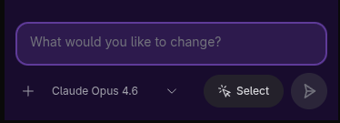
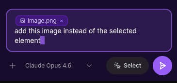
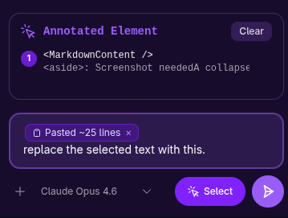
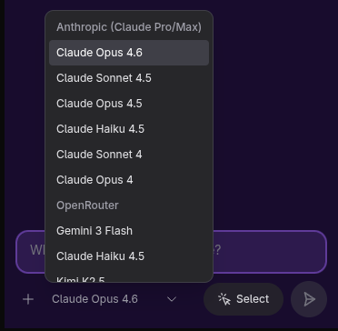
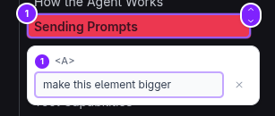
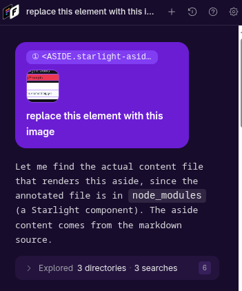
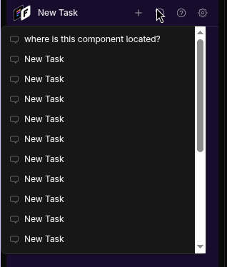

Frontman's chat input is where every change starts. You type what you want, optionally attach context, and the agent takes it from there. This page covers the mechanics of the input — what you can send, how to scope your requests, and what makes a good prompt.

For advanced patterns like iterating, chaining, and course-correcting, see [Prompt Strategies](/docs/using/prompt-strategies/).

## The prompt input

The chat input bar sits at the bottom of the Frontman panel. It supports:

- **Text** — plain language describing your change
- **Image attachments** — screenshots, mockups, or reference images (PNG, JPEG, GIF, WebP)
- **PDF attachments** — design specs or documents
- **Pasted text** — long code snippets or specs collapse into inline chips
- **Annotations** — element selections from the live preview (see [Annotations](/docs/using/annotations/))



### Attaching images

Drag and drop an image onto the chat, paste from your clipboard, or click the attachment button. The agent sees the image alongside your text — useful for:

- Showing a mockup or design comp to match
- Pointing out a bug with a screenshot
- Providing a reference from another page or site



Images are sent as base64-encoded data directly to the LLM, so the agent sees exactly what you see. There's a 10MB file size limit per attachment.

### Pasting long text

When you paste text that's 3+ lines or over 150 characters, Frontman collapses it into an inline chip instead of flooding the input. This keeps the input readable while still sending the full text to the agent.



### Choosing a model

The model selector in the input bar lets you switch between AI models. Which models are available depends on your [API key configuration](/docs/api-keys/).



## Writing effective prompts

### Be specific about what to change

The agent works best when you describe **what** you want changed and **where**.

:::tip[Good vs. vague]
**Good:** "Make the hero section heading 48px and change the subheading color to gray-500"

**Vague:** "Make the hero look better"
:::

| Approach | Example | Why it works |
|----------|---------|-------------|
| **Name the element** | "Change the CTA button text to 'Get started free'" | The agent can search the DOM for it |
| **Describe the location** | "In the pricing section, third column..." | Helps narrow down which component to edit |
| **Use visual language** | "Make the gap between the cards wider" | The agent takes a screenshot first, so visual descriptions work |
| **Reference CSS values** | "Set the font-weight to 600" | Precise values mean fewer iterations |

### Scope your request

Each prompt should target a single, coherent change. The agent handles these well:

**One-shot changes** — things that can be done in a single edit:
```text
"Change the background color of the nav bar to #1a1a2e"
"Replace the placeholder text in the contact form with realistic content"
"Add a 2px solid border to the card component"
```

**Small multi-step changes** — a few related edits:
```text
"Make the pricing cards equal height and add a subtle shadow on hover"
"Update the footer: change the copyright year to 2026 and add a link to /privacy"
```

**Avoid** combining unrelated changes in one prompt:
```text
// Too much at once
"Redesign the header, fix the mobile menu, and update all the button styles"
```

Split those into separate prompts instead — the agent can maintain context across turns.

### Use annotations instead of descriptions

When you can point at something, do it. Click an element in the [live preview](/docs/using/web-preview/) to annotate it before sending your prompt. This gives the agent an exact CSS selector and a screenshot region — far more precise than describing the element in words.



```text
// With annotation (just click the element first):
"Make this larger and bold"

// Without annotation (works, but less precise):
"Make the section heading in the features section larger and bold"
```

See [Annotations](/docs/using/annotations/) for the full guide.

## What the agent does with your prompt

When you hit send, here's what happens:

1. Your text, images, and annotations are packaged together
2. The server sends everything to the LLM along with conversation history
3. The agent typically starts by **taking a screenshot** to see the current state
4. Then it reads the DOM or source files as needed
5. It makes edits and verifies the result

You see each step in real time — the agent's thinking, tool calls, and results all stream into the chat.



See [How the Agent Works](/docs/using/how-the-agent-works/) for the full lifecycle.

## Continuing a conversation

Every conversation in Frontman is a **persistent session**. The agent remembers the full history of messages, tool calls, and edits from that session.

This means you can:

- **Iterate** — "Actually, make that 32px instead of 48px"
- **Follow up** — "Now do the same thing to the other heading"
- **Course-correct** — "That's not what I meant — I want the border on the card, not the container"

The agent sees all previous messages and results, so follow-ups are typically faster than starting fresh.

### Starting a new session

If you want a clean slate — for example, switching to a completely different area of the app — start a new session. Each session maintains its own history and context.



## Prompt examples by task type

### Styling changes

```text
"Increase the padding inside the hero section to 64px top and bottom"
"Change all h2 headings to use font-semibold instead of font-bold"
"Add a subtle background gradient to the features section — light gray to white"
```

### Content changes

```text
"Update the CTA text to 'Start your free trial'"
"Replace the placeholder lorem ipsum in the about section with this: [paste actual content]"
"Change the navigation link 'Products' to 'Solutions'"
```

### Layout changes

```text
"Switch the features section from a 3-column grid to a 2-column grid on desktop"
"Move the testimonial section above the pricing section"
"Make the sidebar collapsible on tablet viewports"
```

### Responsive design

```text
"The cards should stack vertically on mobile instead of side by side"
"Hide the decorative images on screens under 768px"
"Make the font size of the hero heading smaller on mobile — 28px instead of 48px"
```

### Adding elements

```text
"Add a 'Back to top' button that appears when scrolling past 500px"
"Add a badge that says 'New' next to the first feature card"
"Add a divider line between the about section and the team section"
```

## Next steps

- **[Annotations](/docs/using/annotations/)** — point at elements for precision
- **[Prompt Strategies](/docs/using/prompt-strategies/)** — advanced iteration and chaining patterns
- **[The Web Preview](/docs/using/web-preview/)** — navigate and test responsive layouts
- **[Limitations & Workarounds](/docs/using/limitations/)** — what the agent can't do (yet)
